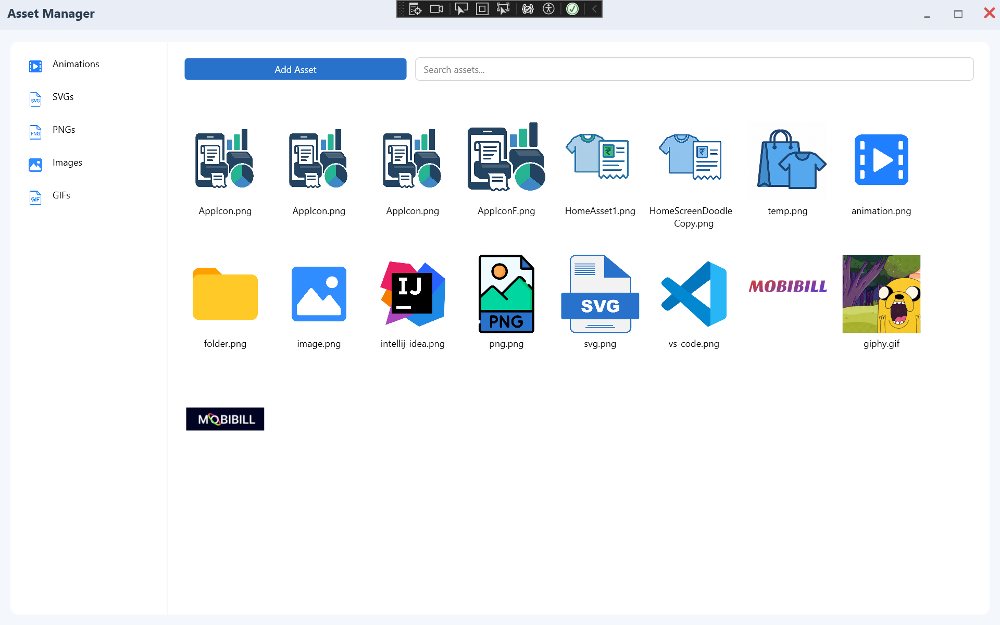

# 🗂️ WPF Asset Manager

A WPF-based desktop application for managing and organizing different types of digital assets including **Lottie animations**, **SVGs**, **PNGs**, **JPGs**, and **GIFs**. The application allows storing, searching, and organizing assets by type and name — even when multiple assets share the same name.

---

## ✨ Features

- 📂 Supports common asset formats: `.json` (Lottie), `.svg`, `.png`, `.jpg`, `.jpeg`, `.gif`
- 🔍 Search assets based on their type or name
- 🏷️ Automatically categorizes files by extension
- 🧾 Supports multiple assets with the same name
- 📁 Easy asset addition and management
- ✅ Clean WPF user interface

---

## 🖼️ Screenshots

### 🧭 Main Screen

